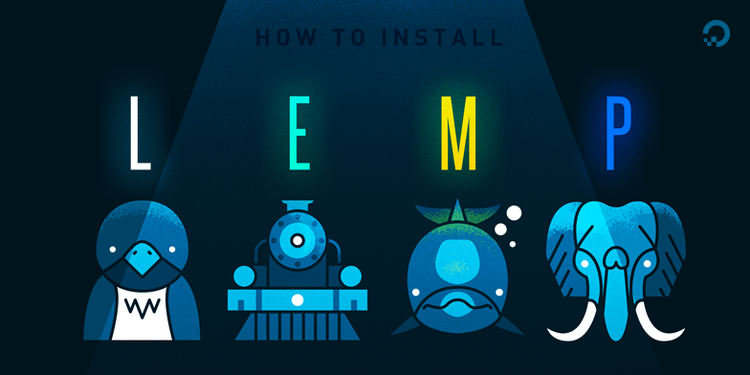

<!-- Improved compatibility of back to top link: See: https://github.com/othneildrew/Best-README-Template/pull/73 -->
<a id="readme-top"></a>
<!--
*** Thanks for checking out the Best-README-Template. If you have a suggestion
*** that would make this better, please fork the repo and create a pull request
*** or simply open an issue with the tag "enhancement".
*** Don't forget to give the project a star!
*** Thanks again! Now go create something AMAZING! :D
-->


<!-- PROJECT SHIELDS -->
<!--
*** I'm using markdown "reference style" links for readability.
*** Reference links are enclosed in brackets [ ] instead of parentheses ( ).
*** See the bottom of this document for the declaration of the reference variables
*** for contributors-url, forks-url, etc. This is an optional, concise syntax you may use.
*** https://www.markdownguide.org/basic-syntax/#reference-style-links
-->
[![Contributors][contributors-shield]][contributors-url]
[![Forks][forks-shield]][forks-url]
[![Stargazers][stars-shield]][stars-url]
[![Issues][issues-shield]][issues-url]
[![MIT License][license-shield]][license-url]
[![LinkedIn][linkedin-shield]][linkedin-url]


<!-- PROJECT LOGO -->
<br />
<div align="center">
  <a href="https://github.com/Vanilla-G/EPA-Dev">
    
  </a>

<h3 align="center">From Code to Cloud: Rise of the LEMPire - DevOps EPA-Dev</h3>

  <p align="center">
    This project involves deploying a scalable and secure WordPress-based e-commerce website for protein products on a LEMP (Linux, Nginx, MariaDB, PHP) stack using AWS. Infrastructure will be provisioned via Terraform for automated setup and management. Cloudflare will enhance security and optimize performance, while SSL certificates will be managed through Certbot for secure HTTPS communication. CI/CD pipelines will be automated using GitHub Actions, ensuring continuous integration and delivery. Monitoring and alerting will be set up with Grafana and Uptime Kuma for ongoing infrastructure and application health tracking.
    <br />
    <a href="https://github.com/Vanilla-G/EPA-Dev"><strong>Explore the docs »</strong></a>
    <br />
    <br />
    <a href="https://github.com/Vanilla-G/EPA-Dev">View Demo</a>
    ·
    <a href="https://github.com/Vanilla-G/EPA-Dev/issues/new?labels=bug&template=bug-report---.md">Report Bug</a>
    ·
    <a href="https://github.com/Vanilla-G/EPA-Dev/issues/new?labels=enhancement&template=feature-request---.md">Request Feature</a>
  </p>
</div>


<!-- TABLE OF CONTENTS -->
<details>
  <summary>Table of Contents</summary>
  <ol>
    <li>
      <a href="#about-the-project">About The Project</a>
      <ul>
        <li><a href="#built-with">Built With</a></li>
      </ul>
    </li>
    <li>
      <a href="#getting-started">Getting Started</a>
      <ul>
        <li><a href="#prerequisites">Prerequisites</a></li>
        <li><a href="#installation">Installation</a></li>
      </ul>
    </li>
    <li><a href="#usage">Usage</a></li>
    <li><a href="#roadmap">Roadmap</a></li>
    <li><a href="#contributing">Contributing</a></li>
    <li><a href="#license">License</a></li>
    <li><a href="#contact">Contact</a></li>
    <li><a href="#acknowledgments">Acknowledgments</a></li>
  </ol>
</details>


<!-- ABOUT THE PROJECT -->
## About The Project

The project involves deploying a WordPress-based e-commerce website specialising in protein products. The deployment will utilise a LEMP (Linux, Nginx, MariaDB, PHP) stack on AWS. Infrastructure will be provisioned and managed using Terraform. Cloudflare will be implemented for enhanced security and performance. Certbot will be used to obtain certifications authority and manage SSL certificates for the website, ensuring secure HTTPS communication. CI/CD processes will be automated using GitHub Actions to ensure continuous integration and delivery. 

Objectives:
1. Infrastructure Setup: Deploy a scalable and secure LEMP stack on AWS or Azure provisioned through IaC using Terraform.
2. Website Deployment: Set up WordPress as the content management system for the e-commerce store.
3. Security: Implement and utilise Cloudflare to secure the website and optimise its performance and leveraging Github Secrets for access tokens.
4. CI/CD Pipeline: Use GitHub Actions to automate testing, building, and deployment processes.
5. Monitoring and Maintenance: Set up monitoring and alerting for the infrastructure and application with a Grafana stack and Uptime Kuma applications.

<p align="center">
  
</p>

<p align="center">
  <a href="https://tryhackme.com/p/PinkBeef">
    
  </a>
</p>


<p align="right">(<a href="#readme-top">back to top</a>)</p>


### Built With

<div align="center">

|  |  |  |
|-------------------------------------------------------------------------------------------------------|------------------------------------------------------------------------------------------------------|-------------------------------------------------------------------------------------------------------------|
|  |  |  |
|  |  |  |
|  |  |  |
</div>


<p align="right">(<a href="#readme-top">back to top</a>)</p>


<!-- GETTING STARTED -->
# Getting Started  

Welcome to **From Code to Cloud: Rise of the LEMPire - DevOps EPA-Dev**! This guide will help you set up your project locally and deploy a scalable, secure WordPress-based e-commerce website on the LEMP stack using AWS. Follow these steps to get started quickly.  

---

## Prerequisites  

Ensure you have the following installed and configured before proceeding:  

### Required Tools  
- **Terraform**: Infrastructure provisioning and management  
  - [Install Terraform](https://developer.hashicorp.com/terraform/tutorials/aws-get-started/install-cli)  
- **AWS CLI**: Interact with AWS services  
  - [Install AWS CLI](https://aws.amazon.com/cli/)  
- **Nginx**: Web server for hosting  
  - [Install Nginx](https://nginx.org/en/docs/install.html)  
- **Certbot**: SSL certificate management  
  - [Install Certbot](https://certbot.eff.org/)  
- **Docker (Optional)**: For local testing of services  
  - [Install Docker](https://docs.docker.com/get-docker/)  

Ensure your AWS IAM account has sufficient permissions for deploying resources via Terraform.  

---

## Installation  

Follow these steps to clone, set up, and configure the project:  

1. **Clone the Repository**  
   ```bash  
   git clone https://github.com/Vanilla-G/EPA-Dev.git  
   cd EPA-Dev  

_For more examples, please refer to the [Documentation](https://example.com)_

<p align="right">(<a href="#readme-top">back to top</a>)</p>

## Usage  

Explore the deployed site to see the scalable WordPress-based e-commerce website for protein products in action.  

### Examples of Features  
- Fully deployed **LEMP stack** with optimized **Cloudflare caching**  
- Automated **CI/CD pipelines** for continuous integration and deployment  
- **SSL-secured communications** with Certbot  

### Monitoring and Alerts  
- **Grafana dashboards** and **Uptime Kuma** provide comprehensive monitoring and alerting for infrastructure and application health.  

For detailed usage instructions, refer to the [Documentation](#).  


<!-- ROADMAP -->
## Roadmap

- [ ] Feature 1
- [ ] Feature 2
- [ ] Feature 3
    - [ ] Nested Feature

See the [open issues](https://github.com/Vanilla-G/EPA-Dev/issues) for a full list of proposed features (and known issues).

<p align="right">(<a href="#readme-top">back to top</a>)</p>


<!-- CONTRIBUTING -->
## Contributing

Contributions are what make the open source community such an amazing place to learn, inspire, and create. Any contributions you make are **greatly appreciated**.

If you have a suggestion that would make this better, please fork the repo and create a pull request. You can also simply open an issue with the tag "enhancement".
Don't forget to give the project a star! Thanks again!

1. Fork the Project
2. Create your Feature Branch (`git checkout -b feature/AmazingFeature`)
3. Commit your Changes (`git commit -m 'Add some AmazingFeature'`)
4. Push to the Branch (`git push origin feature/AmazingFeature`)
5. Open a Pull Request

<p align="right">(<a href="#readme-top">back to top</a>)</p>

### Top contributors:

<a href="https://github.com/Vanilla-G/EPA-Dev/graphs/contributors">
  
</a>


<!-- LICENSE -->
## License

Distributed under the MIT License. See `LICENSE.txt` for more information.

<p align="right">(<a href="#readme-top">back to top</a>)</p>


<!-- CONTACT -->
## Contact

Your Name - [@twitter_handle](https://twitter.com/twitter_handle) - grahamball404@gmail.com

Project Link: [https://github.com/Vanilla-G/EPA-Dev](https://github.com/Vanilla-G/EPA-Dev)

<p align="right">(<a href="#readme-top">back to top</a>)</p>


<!-- ACKNOWLEDGMENTS -->
## Acknowledgments

* []()
* []()
* []()

<p align="right">(<a href="#readme-top">back to top</a>)</p>


<!-- MARKDOWN LINKS & IMAGES -->
<!-- https://www.markdownguide.org/basic-syntax/#reference-style-links -->
[contributors-shield]: https://img.shields.io/github/contributors/Vanilla-G/EPA-Dev.svg?style=for-the-badge
[contributors-url]: https://github.com/Vanilla-G/EPA-Dev/graphs/contributors
[forks-shield]: https://img.shields.io/github/forks/Vanilla-G/EPA-Dev.svg?style=for-the-badge
[forks-url]: https://github.com/Vanilla-G/EPA-Dev/network/members
[stars-shield]: https://img.shields.io/github/stars/Vanilla-G/EPA-Dev.svg?style=for-the-badge
[stars-url]: https://github.com/Vanilla-G/EPA-Dev/stargazers
[issues-shield]: https://img.shields.io/github/issues/Vanilla-G/EPA-Dev.svg?style=for-the-badge
[issues-url]: https://github.com/Vanilla-G/EPA-Dev/issues
[license-shield]: https://img.shields.io/github/license/Vanilla-G/EPA-Dev.svg?style=for-the-badge
[license-url]: https://github.com/Vanilla-G/EPA-Dev/blob/main/LICENSE.txt
[linkedin-shield]: https://img.shields.io/badge/-LinkedIn-black.svg?style=for-the-badge&logo=linkedin&colorB=559
[linkedin-url]: https://linkedin.com/in/grahamball-gl50-m32-remote
[product-screenshot]: images/screenshot.png
[Next.js]: https://img.shields.io/badge/next.js-000000?style=for-the-badge&logo=nextdotjs&logoColor=white
[Next-url]: https://nextjs.org/
[React.js]: https://img.shields.io/badge/React-20232A?style=for-the-badge&logo=react&logoColor=61DAFB
[React-url]: https://reactjs.org/
[Vue.js]: https://img.shields.io/badge/Vue.js-35495E?style=for-the-badge&logo=vuedotjs&logoColor=4FC08D
[Vue-url]: https://vuejs.org/
[Angular.io]: https://img.shields.io/badge/Angular-DD0031?style=for-the-badge&logo=angular&logoColor=white
[Angular-url]: https://angular.io/
[Svelte.dev]: https://img.shields.io/badge/Svelte-4A4A55?style=for-the-badge&logo=svelte&logoColor=FF3E00
[Svelte-url]: https://svelte.dev/
[Laravel.com]: https://img.shields.io/badge/Laravel-FF2D20?style=for-the-badge&logo=laravel&logoColor=white
[Laravel-url]: https://laravel.com
[Bootstrap.com]: https://img.shields.io/badge/Bootstrap-563D7C?style=for-the-badge&logo=bootstrap&logoColor=white
[Bootstrap-url]: https://getbootstrap.com
[JQuery.com]: https://img.shields.io/badge/jQuery-0769AD?style=for-the-badge&logo=jquery&logoColor=white
[JQuery-url]: https://jquery.com 

[Ubuntu.icon]: https://img.shields.io/badge/Ubuntu%20-%20red?style=for-the-badge&logo=ubuntu&logoColor=red
[Ubuntu-url]: https://ubuntu.com/server


